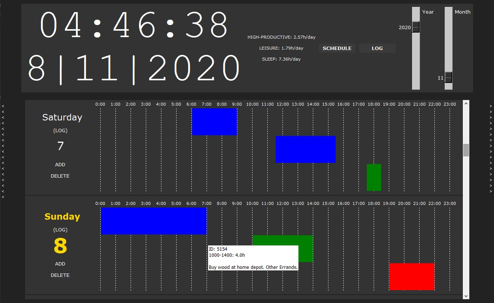
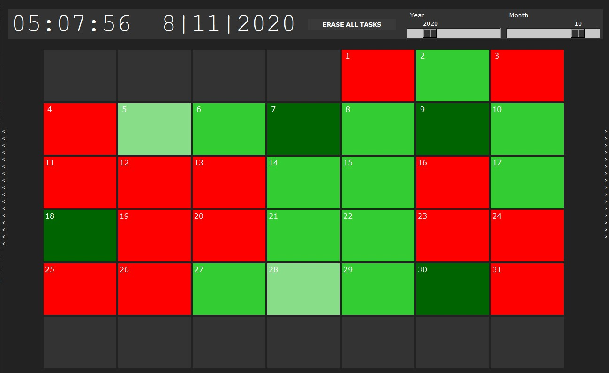

# DayLogger
TECHNICAL SKILLS APPLIED:
- Learned how to use the Tkinter(Python GUI library)
- Practiced design, implementation and debugging
- Used object-oriented programming and Python to organize tasks
- Used SQL to store tasks
- Learned what makes a good using experience from everyday use and frequent adjustments

- /

DESCRIPTION: 
- Colors represent how how productive a task or day is.
- Can navigate and store thousand of tasks for years to come

Author: Jadd
Date Nov 25, 2020
